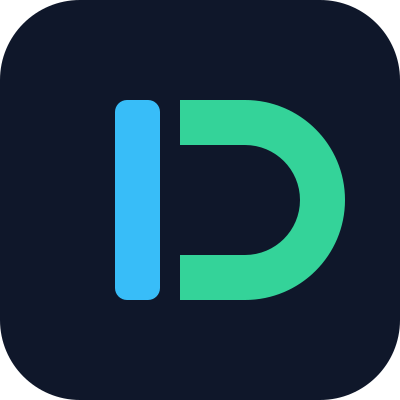

  

  # Daviante Group
  
  **Writing code for the enterprise, building cool stuff for the community.**

  
  
  

---

## 🧭 Navigation
* [👋 Who We Are](#-who-we-are)
* [⚡ Core Principles](#-core-principles)
* [📂 Featured Projects](#-featured-projects)
* [📫 Connect With Us](#-connect-with-us)

---

## 👋 Who We Are

We are a collective of developers focused on solving interesting problems. No buzzwords—just clean architecture, solid code, and a passion for building things that actually work well. 

Whether we are engineering scalable enterprise systems or crafting open-source utilities, our philosophy remains rooted in simplicity, performance, and maintainability.

---

## ⚡ Core Principles

* **Clean Architecture:** Designing maintainable, decoupled systems that scale gracefully over time.
* **Pragmatic Engineering:** Choosing the right tool for the job over chasing fleeting industry trends.
* **Community First:** Believing that great software is built collaboratively and shared openly.

---

## 📂 Featured Projects

*Check out our pinned repositories below or visit our repositories tab to explore our latest open-source contributions.*

---

## 📫 Connect With Us

* **Website:** [daviante.dev](https://daviante.dev)
* **Email:** [code@daviante.dev](mailto:code@daviante.dev)
